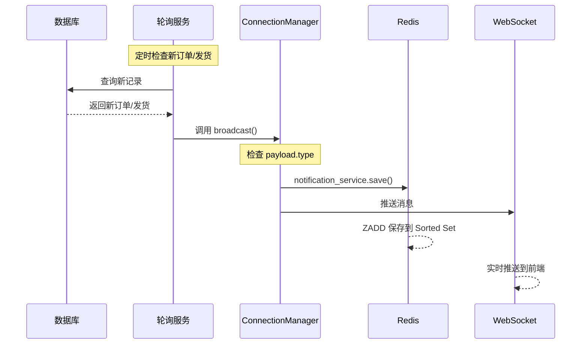

# WebSocket 消息通知 Redis 保存修复设计文档

**日期:** 2026-04-11  
**问题:** 订单/发货通知 WebSocket 推送正常，但未保存到 Redis  
**状态:** 待用户审查

---

## 1. 问题描述

### 1.1 现象

| 功能 | WebSocket 实时推送 | Redis 历史保存 |
|------|-------------------|---------------|
| 新建订单通知 | ❌ 失败 | ❌ 失败 |
| 发货通知 | ✅ 正常 | ❌ 失败 |
| mark_shipped 旧代码 | (已废弃) | (已废弃) |

### 1.2 影响

- 前端无法查看历史订单/发货通知记录
- 刷新页面后通知消息丢失
- 未读计数无法正确累计

---

## 2. 根本原因分析

### 2.1 代码追溯

```
notification_service.py (Line 143-154)
├── manager.broadcast(message)
│   ├── 检查 payload.type 是否存在
│   └── 如果存在 → 保存到 Redis
│       └── 不存在 → 跳过保存
```

```python
# notification_service.py:143-154
async def broadcast(self, message: dict):
    payload = message.get('payload', {})
    msg_type = payload.get('type')  # 关键检查

    if msg_type:  # 只有 type 存在时才保存
        for uid in self.active_connections.keys():
            notification_service.save(uid, payload)
```

### 2.2 问题定位

| 文件 | payload 结构 | 缺少字段 |
|------|-------------|---------|
| `order_poller.py:81` | `{notification_type: "order_created", ...}` | `type` |
| `shipment_poller.py:88` | `{notification_type: "order_shipped", ...}` | `type` |

### 2.3 代码对比

**正常的发货通知 (mark_shipped 旧代码):**
```python
# order_service.py:315-330
notification_msg = {
    "type": "notification",  # ✅ 有 type 字段
    "payload": {
        "type": "order_shipped",  # ✅ 有 type
        "title": "订单已发货",
        ...
    }
}
```

**异常的轮询通知:**
```python
# order_poller.py:79-98
notification = {
    "type": "notification",  # ✅ 外层有 type
    "payload": {
        # ❌ 内层缺少 type 字段!
        "notification_type": "order_created",
        "title": "新建订单",
        ...
    }
}
```

```python
# shipment_poller.py:84-103
notification = {
    "type": "notification",  # ✅ 外层有 type
    "payload": {
        # ❌ 内层缺少 type 字段!
        "notification_type": "order_shipped",
        "title": "订单已发货",
        ...
    }
}
```

---

## 3. 修复方案

### 3.1 修改 order_poller.py

**文件:** `backend/app/services/order_poller.py`

**修改点:** 第 81-98 行的 payload 结构

```python
# 修改前 (第 79-98 行)
notification = {
    "type": "notification",
    "payload": {
        "id": f"order_{order_list.id}_{int(datetime.now().timestamp())}",
        "notification_type": "order_created",  # ❌ 字段名错误
        "title": "新建订单",
        "content": f"{order_list.订单编号} 于 {order_time} 创建，共计 ￥{total_amount:.2f}",
        "timestamp": int(datetime.now().timestamp()),
        "detail_id": order_list.id,
        "detail_type": "order",
        "detail": { ... }
    }
}

# 修改后
notification = {
    "type": "notification",
    "payload": {
        "id": f"order_{order_list.id}_{int(datetime.now().timestamp())}",
        "type": "order_created",              # ✅ 改为 type
        "title": "新建订单",
        "content": f"{order_list.订单编号} 于 {order_time} 创建，共计 ￥{total_amount:.2f}",
        "timestamp": int(datetime.now().timestamp()),
        "detail_id": order_list.id,
        "detail_type": "order",
        "detail": { ... }
    }
}
```

### 3.2 修改 shipment_poller.py

**文件:** `backend/app/services/shipment_poller.py`

**修改点:** 第 84-103 行的 payload 结构

```python
# 修改前 (第 84-103 行)
notification = {
    "type": "notification",
    "payload": {
        "id": f"ship_{ship.id}_{int(datetime.now().timestamp())}",
        "notification_type": "order_shipped",  # ❌ 字段名错误
        "title": "订单已发货",
        ...
    }
}

# 修改后
notification = {
    "type": "notification",
    "payload": {
        "id": f"ship_{ship.id}_{int(datetime.now().timestamp())}",
        "type": "order_shipped",              # ✅ 改为 type
        "title": "订单已发货",
        ...
    }
}
```

---

## 4. 验证方案

### 4.1 单元测试

```bash
# 测试 Redis 连接
cd backend && python -c "from app.services.notification_service import notification_service; print(notification_service.redis_client.ping())"

# 测试通知保存
cd backend && python -c "
from app.services.notification_service import notification_service
notification_service.save(1, {'type': 'test', 'title': '测试'})
print('Save OK')
"
```

### 4.2 手动验证步骤

1. 启动后台服务 `python -m uvicorn app.main:app --reload`
2. 打开前端页面，连接 WebSocket
3. 通过 API 创建一个新订单: `POST /api/order/create`
4. 检查:
   - WebSocket 是否收到订单通知消息
   - Redis 中是否有保存: `redis-cli ZRANGE "notifications:1" 0 -1`
5. 通过 API 标记发货: `POST /api/order/mark-shipped`
6. 检查:
   - WebSocket 是否收到发货通知
   - Redis 中是否有保存

### 4.3 预期结果

| 场景 | 修改前 | 修改后 |
|------|-------|-------|
| 订单创建 WebSocket | ❌ 无响应 | ✅ 收到通知 |
| 订单创建 Redis | ❌ 无保存 | ✅ 已保存 |
| 发货 WebSocket | ✅ 收到通知 | ✅ 收到通知 |
| 发货 Redis | ❌ 无保存 | ✅ 已保存 |

---

## 5. 影响范围

### 5.1 修改文件

| 文件 | 修改行数 | 风险等级 |
|------|---------|---------|
| `order_poller.py` | 1 行 | 低 |
| `shipment_poller.py` | 1 行 | 低 |

### 5.2 无影响模块

- 前端代码无需修改
- API 接口无需修改
- 数据库结构无需修改
- `mark_shipped` 相关代码已废弃，无需处理

---

## 6. 架构图



---

## 7. 附录: 关键代码片段

### 7.1 notification_service.py broadcast 方法

```python
# backend/app/services/notification_service.py:143-162
async def broadcast(self, message: dict):
    """广播消息给所有用户，同时保存到 Redis"""
    payload = message.get('payload', {})
    msg_type = payload.get('type')  # <-- 关键: 这里检查 type

    # 保存到所有在线用户的 Redis
    if msg_type:  # <-- 只有 type 存在时才保存
        for uid in self.active_connections.keys():
            try:
                notification_service.save(uid, payload)
            except (ValueError, TypeError) as e:
                logger.warning(f"Failed to save notification for user {uid}: {e}")

    # 推送给所有在线用户
    for uid, connections in self.active_connections.items():
        for connection in connections:
            try:
                await connection.send_json(message)
            except Exception as e:
                logger.warning(f"Failed to send WebSocket message: {e}")
```

### 7.2 payload 结构对比

| 字段 | 旧代码 (mark_shipped) | 轮询代码 (当前) | 轮询代码 (修复后) |
|------|---------------------|----------------|------------------|
| payload.type | ✅ `order_shipped` | ❌ `notification_type` | ✅ `order_created` / `order_shipped` |
| payload.notification_type | 无 | ❌ 存在但无效 | ❌ 移除 |
