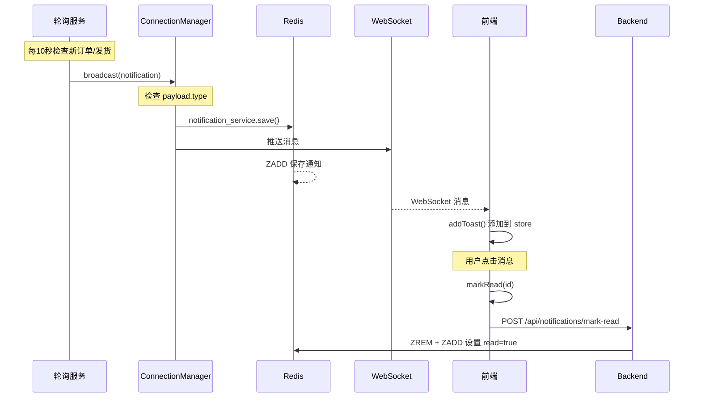

# WebSocket 消息通知系统修复文档

**日期:** 2026-04-11  
**问题:** 订单/发货通知 WebSocket 推送正常，但未保存到 Redis，点击消息后状态不正确

---

## 1. 问题列表

| # | 问题描述 | 根本原因 | 修复方案 |
|---|---------|---------|---------|
| 1 | 订单/发货通知未保存到 Redis | payload 中使用 `notification_type` 字段，但 broadcast 检查的是 `type` 字段 | 将 `notification_type` 改为 `type` |
| 2 | 发货通知标题显示"订单已发货" | 标题文案不一致 | 改为"发货订单" |
| 3 | 订单通知标题显示"新建订单" | 标题文案不一致 | 改为"新增订单" |
| 4 | 点击消息后消息消失 | `handleNotificationClick` 调用了 `removeNotification` | 改为调用 `markRead` |
| 5 | 点击消息后未读数字不减少 | `notification-icon` 显示的是 `notifications.length` | 改为 `notifications.length - readIds.size` |
| 6 | 刷新页面后已读状态丢失 | 从 Redis 获取历史通知时未读取 `read` 字段 | 添加 `setReadIds` 初始化已读状态 |
| 7 | mark-read API 返回 401 | 前端调用时未携带 Authorization header | 添加 `Authorization: Bearer ${token}` |
| 8 | WebSocket 双重连接导致连接不稳定 | React StrictMode 双重调用 useEffect | 添加 `isConnecting` 状态防止重复连接 |

---

## 2. 修改文件清单

### 后端 (2 个文件)

| 文件 | 修改内容 |
|------|---------|
| `backend/app/services/order_poller.py:83` | `notification_type` → `type` |
| `backend/app/services/order_poller.py:84` | `"新建订单"` → `"新增订单"` |
| `backend/app/services/shipment_poller.py:88` | `notification_type` → `type` |
| `backend/app/services/shipment_poller.py:89` | `"订单已发货"` → `"发货订单"` |

### 前端 (3 个文件)

| 文件 | 修改内容 |
|------|---------|
| `src/stores/notification-store.ts` | 添加 `readIds`, `markRead`, `markAllRead`, `isRead`, `setReadIds` |
| `src/hooks/use-notification.ts` | 从 Redis 获取通知时初始化 `readIds` |
| `src/components/notifications/notification-drawer.tsx` | 点击改为 markRead + 调用后端 API |
| `src/components/notifications/notification-icon.tsx` | 显示未读数 = `notifications.length - readIds.size` |
| `src/lib/websocket.ts` | 添加 `isConnecting` 防止重复连接 |

---

## 3. 核心流程



---

## 4. 数据结构

### Notification Store

```typescript
interface Notification {
  id: string
  notification_type: string  // order_created / order_shipped
  title: string
  content: string
  timestamp: number
  detail_id?: number
  detail_type?: string
  detail?: any
  read?: boolean
}

interface NotificationState {
  toasts: Notification[]
  notifications: Notification[]
  readIds: Set<string>       // 已读ID集合
  // ...
}
```

### Redis Notification

```json
{
  "id": "order_123_1234567890",
  "type": "order_created",
  "title": "新增订单",
  "content": "DH-20260411-001 于 2026-04-11 17:00 创建，共计 ￥1000.00",
  "timestamp": 1234567890,
  "detail_id": 123,
  "detail_type": "order",
  "detail": { ... },
  "created_at": "2026-04-11T17:00:00",
  "read": false
}
```

---

## 5. API 接口

### 获取历史通知
```
GET /api/notifications?page=1&page_size=50
Authorization: Bearer <token>
```

### 标记已读
```
POST /api/notifications/mark-read
Authorization: Bearer <token>
Content-Type: application/json

{
  "notification_id": "order_123_1234567890"
}
```

### 获取未读数
```
GET /api/notifications/unread-count
Authorization: Bearer <token>
```

---

## 6. 已验证功能

- [x] 创建新订单 → WebSocket 推送 + Redis 保存
- [x] 发货 → WebSocket 推送 + Redis 保存
- [x] 点击消息 → 标记已读，消息保留
- [x] 未读计数正确减少
- [x] 刷新页面保持已读状态
- [x] WebSocket 连接稳定（无双重连接）

---

## 7. 后续优化建议

1. **用户特定通知**: 当前广播给所有用户，应改为只推送给相关用户
2. **未读计数 API**: 前端应调用 `/api/notifications/unread-count` 获取未读数
3. **历史通知分页**: 当前前端一次性获取 50 条，应支持分页加载
4. **通知过期清理**: Redis TTL 30 天，可考虑主动清理已读通知
