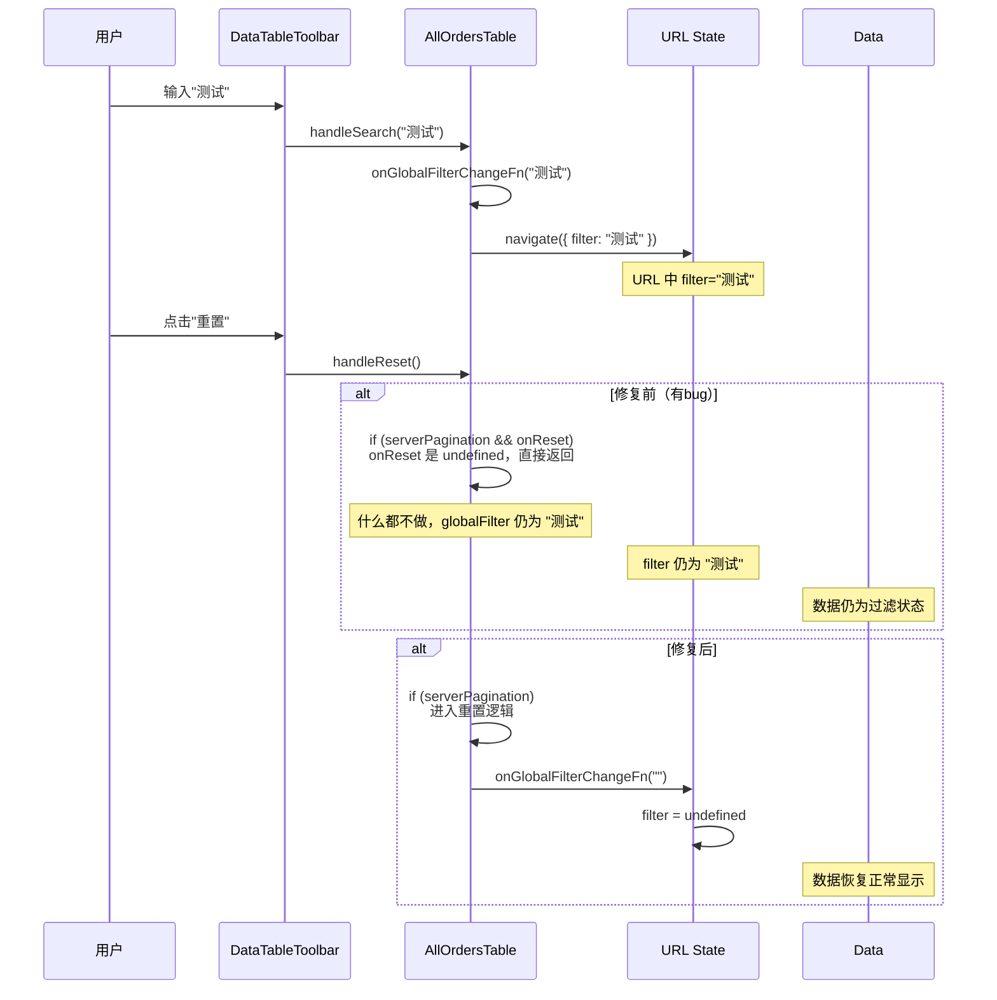

# Bug修复记录：订单分项页面搜索重置功能失效

## 问题描述
- **模块**：订单分项页面 (AllOrders)
- **症状**：输入搜索内容后，点击重置按钮不返回全部数据
- **影响**：用户无法通过重置按钮清除搜索过滤

## 根因分析

### 问题定位
1. `AllOrders.tsx` 使用 `useTableUrlState` hook 管理分页和全局过滤状态
2. 全局过滤的 `globalFilter` 通过 URL 的 `filter` 参数同步
3. `AllOrdersTable` 组件接收 `onGlobalFilterChange` 回调来处理过滤变化

### 根本原因
在 `AllOrdersTable` 组件的 `handleReset` 函数中：

```typescript
// 修复前
const handleReset = useCallback(() => {
  if (serverPagination && onReset) {
    onReset()
  }
}, [serverPagination, onReset])
```

**问题**：
1. 重置逻辑依赖于 `onReset` prop，但 `AllOrders.tsx` 没有传递 `onReset` prop
2. 即使 `onReset` 存在，它也没有清除 URL 中的 `filter` 参数
3. `handleReset` 调用后，`globalFilter` 仍然是输入的值，导致数据仍然是过滤状态

### 数据流分析



## 修复方案

### 修改文件
`src/features/orders/components/allorders-table.tsx`

### 修改内容
```diff
  const handleReset = useCallback(() => {
-   if (serverPagination && onReset) {
+   if (serverPagination) {
      onReset?.()
+     onGlobalFilterChangeFn?.('')
    }
- }, [serverPagination, onReset])
+ }, [serverPagination, onReset, onGlobalFilterChangeFn])
```

### 修复说明
1. 移除了对 `onReset` prop 的依赖
2. 添加了 `onGlobalFilterChangeFn?.('')` 调用来清除全局过滤状态
3. 这会自动更新 URL 中的 `filter` 参数为 `undefined`

## 验证结果
- TypeScript 类型检查通过
- 修复后重置按钮能正确清除搜索条件并显示全部数据

## 修复日期
2026-04-07

## 相关组件
- `AllOrders.tsx` - 页面组件
- `AllOrdersTable.tsx` - 表格组件（已修复）
- `DataTableToolbar.tsx` - 工具栏组件
- `useTableUrlState` - URL状态管理hook
