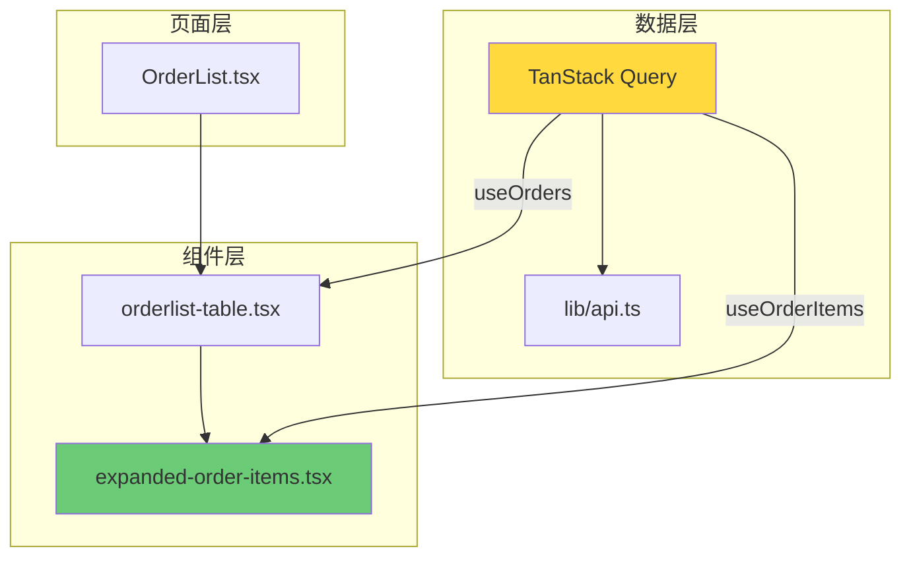

# 订单列表组件化重构经验总结

**日期**: 2026-04-07
**项目**: shadcn-admin
**状态**: 已完成

---

## 一、重构背景

订单列表页面 (`OrderList.tsx` + `orderlist-table.tsx`) 存在以下问题：
- 代码量过大（869 行）
- 数据获取使用手动的 `useEffect + fetchData`
- 展开行逻辑内联在表格组件中
- Dialog 状态散落在页面组件中
- 使用 `refreshKey` 手动刷新数据

---

## 二、重构内容

### 1. 新增文件

```
src/
├── queries/
│   └── orders/
│       ├── keys.ts                    # Query Keys 定义
│       ├── useOrders.ts              # 订单列表查询
│       ├── useOrderItems.ts          # 订单分项查询
│       ├── useCreateOrder.ts         # 创建订单 mutation
│       ├── useUpdateOrder.ts         # 更新订单 mutation
│       ├── useDeleteOrder.ts         # 删除订单 mutation
│       ├── useCreateOrderItem.ts     # 创建订单分项 mutation
│       ├── useUpdateOrderItem.ts     # 更新订单分项 mutation
│       └── useDeleteOrderItem.ts     # 删除订单分项 mutation
└── features/orders/
    ├── hooks/
    │   ├── index.ts
    │   ├── useOrderDialogs.ts        # Dialog 状态管理
    │   └── useOrderItemDialogs.ts   # 订单分项 Dialog 状态
    └── components/
        └── expanded-order-items.tsx  # 展开行组件
```

### 2. 主要修改

| 文件 | 改动 |
|------|------|
| `orderlist-table.tsx` | 使用 TanStack Query，抽取 ExpandedOrderItems |
| `OrderList.tsx` | 简化状态管理 |

---

## 三、关键经验

### 经验 1：mutationFn 必须返回数据

**问题**：创建订单后需要订单 ID 来保存订单分项，但 `useCreateOrder` 的 `mutationFn` 没有返回数据。

```tsx
// ❌ 错误：返回 undefined
mutationFn: (data) => orderListAPI.createOrder(data)

// ✅ 正确：返回 response.data
mutationFn: async (data) => {
  const response = await orderListAPI.createOrder(data)
  return response.data
}
```

### 经验 2：TanStack Query 缓存 ≠ 本地状态

**问题**：TanStack Query 的 `invalidateQueries` 只会清除全局缓存，不会清除组件本地的 `childData` state。

**解决**：使用 `refreshKey` 机制触发子组件重新获取数据。

```tsx
// 父组件
const handleSave = async (data) => {
  await createMutation.mutateAsync(data)
  setRefreshKey(k => k + 1)  // 触发刷新
}

// 子组件
useEffect(() => {
  if (refreshKey > 0) {
    setChildData({})  // 清除本地缓存
    for (const id of expandedRows) {
      fetchChildData(id)  // 重新获取
    }
  }
}, [refreshKey, expandedRows])
```

### 经验 3：组件拆分原则

| 组件类型 | 职责 |
|---------|------|
| 页面容器 | 状态管理、Dialg 组合 |
| 表格组件 | TanStack Table + 数据获取 |
| 展开行组件 | 可复用的嵌套表格 |
| Query Hooks | 服务端数据获取 |
| Dialog Hooks | UI 状态管理 |

---

## 四、架构图



---

## 五、验证清单

- [x] 订单列表页面可正常加载
- [x] 展开订单行显示订单分项
- [x] 创建订单分项后自动刷新显示
- [x] 编辑/删除订单分项后自动刷新
- [x] 新增/编辑/删除订单功能正常
- [x] 批量删除功能正常
- [x] 筛选和分页功能正常

---

## 六、后续建议

1. **复用 ExpandedOrderItems** - 可在 `AllOrders.tsx` 等模块复用
2. **抽取 useOrderDialogs** - 进一步简化 OrderList.tsx
3. **统一类型定义** - 消除 `any` 类型
