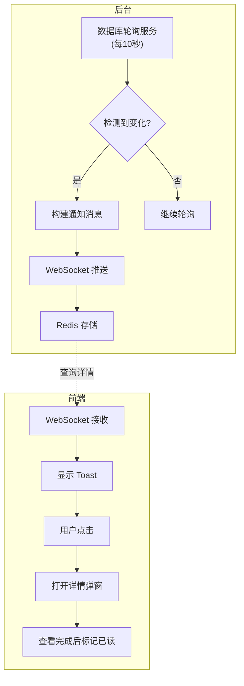

# 通知系统重构 - 简化方案

**日期**: 2026-04-11
**状态**: 进行中

---

## 1. 问题分析

### 当前问题
1. 前端实现过于复杂，多个组件和状态管理交织
2. 前端主动调用 API 标记已读，增加复杂度
3. 消息同步问题（WebSocket + Redis + 前端状态不一致）

### 简化原则
- **后台轮询** - 后台定时检测数据库变化，主动推送
- **前端轻量化** - 前端只接收和显示，不管理状态
- **后台自动已读** - 查看详情后后台自动标记

---

## 2. 方案设计

### 2.1 架构图



### 2.2 后台轮询检测

| 监控目标 | 检测条件 | 通知类型 |
|---------|---------|---------|
| 发货表 (Ship) | 新增记录 | order_shipped |
| 订单列表 (OrderList) | 新增记录 | order_created |

### 2.3 轮询服务设计

```python
class NotificationPoller:
    """后台轮询服务 - 检测数据库变化并推送通知"""
    
    def __init__(self):
        self.last_check_time = datetime.now()
        self.interval = 10  # 每10秒轮询
    
    async def check_new_shipments(self, db):
        """检测新发货记录"""
        # 查询自上次检查以来的新发货
        # 构建通知消息
        # 推送给相关用户
        pass
    
    async def check_new_orders(self, db):
        """检测新订单"""
        pass
```

### 2.4 WebSocket 消息格式

```python
{
    "type": "notification",
    "payload": {
        "id": "uuid",
        "notification_type": "order_shipped",  # order_shipped / order_created
        "title": "订单已发货",
        "content": "订单 DH-xxx 已发货",
        "timestamp": 1744358400,
        "detail_id": 123,  # 用于查询详情的 ID
        "detail_type": "ship"  # ship / order
    }
}
```

### 2.5 前端简化

#### 前端职责
1. 建立 WebSocket 连接
2. 接收通知，显示 Toast
3. 点击 Toast → 调用 API 获取详情 → 打开弹窗
4. 查看完成后调用 API 标记已读

#### 前端组件（简化后）

```
src/components/notifications/
├── notification-toast.tsx      # Toast（只接收和显示）
├── notification-drawer.tsx      # 消息中心（只读列表）
└── notification-detail-dialog.tsx  # 详情弹窗
```

#### Notification Store（大幅简化）

```typescript
interface NotificationState {
  // 只保留显示相关的状态
  toasts: Notification[]
  isDrawerOpen: boolean
  
  // Actions
  addToast: (notification: Notification) => void
  removeToast: (id: string) => void
  setDrawerOpen: (open: boolean) => void
}
```

### 2.6 API 接口

| 方法 | 路径 | 说明 |
|------|------|------|
| GET | `/notifications/detail/{type}/{id}` | 获取通知详情 |
| POST | `/notifications/mark-read` | 标记已读（查看完成后） |

---

## 3. 前端交互流程

```
用户操作                  前端行为                后台行为
─────────────────────────────────────────────────────────
1. 页面加载         →   建立 WebSocket    →   保持连接
2. 后台检测到发货   ←   收到通知消息      ←   轮询检测
3. 自动显示         →   Toast 弹出       →   
4. 用户点击 Toast   →   调用 API 获取详情 →   返回详细信息
5. 打开详情弹窗     ←   显示详情         ←   
6. 用户关闭弹窗    →   标记已读 API     →   更新已读状态
```

---

## 4. 与当前实现的对比

| 项目 | 当前实现 | 简化后 |
|------|---------|--------|
| 触发方式 | 业务代码显式调用 | 后台轮询自动检测 |
| 前端状态 | 复杂（notifications, toasts, detail 等） | 极简（只管 Toast） |
| 已读处理 | 前端主动调用 API | 后台自动标记 |
| 代码量 | ~500 行前端 | ~150 行前端 |
| 维护成本 | 高 | 低 |

---

## 5. 待实现任务

### 阶段 A: 后台轮询服务
- [ ] 创建 `notification_poller.py` 轮询服务
- [ ] 检测发货表新记录
- [ ] 检测订单表新记录
- [ ] 整合 WebSocket 推送

### 阶段 B: 前端简化
- [ ] 简化 `notification-store.ts`
- [ ] 简化 `notification-toast.tsx`
- [ ] 简化 `notification-drawer.tsx`
- [ ] 添加详情获取 API 调用

### 阶段 C: 清理
- [ ] 删除不再需要的代码
- [ ] 清理冗余的 API 端点
- [ ] 更新文档
