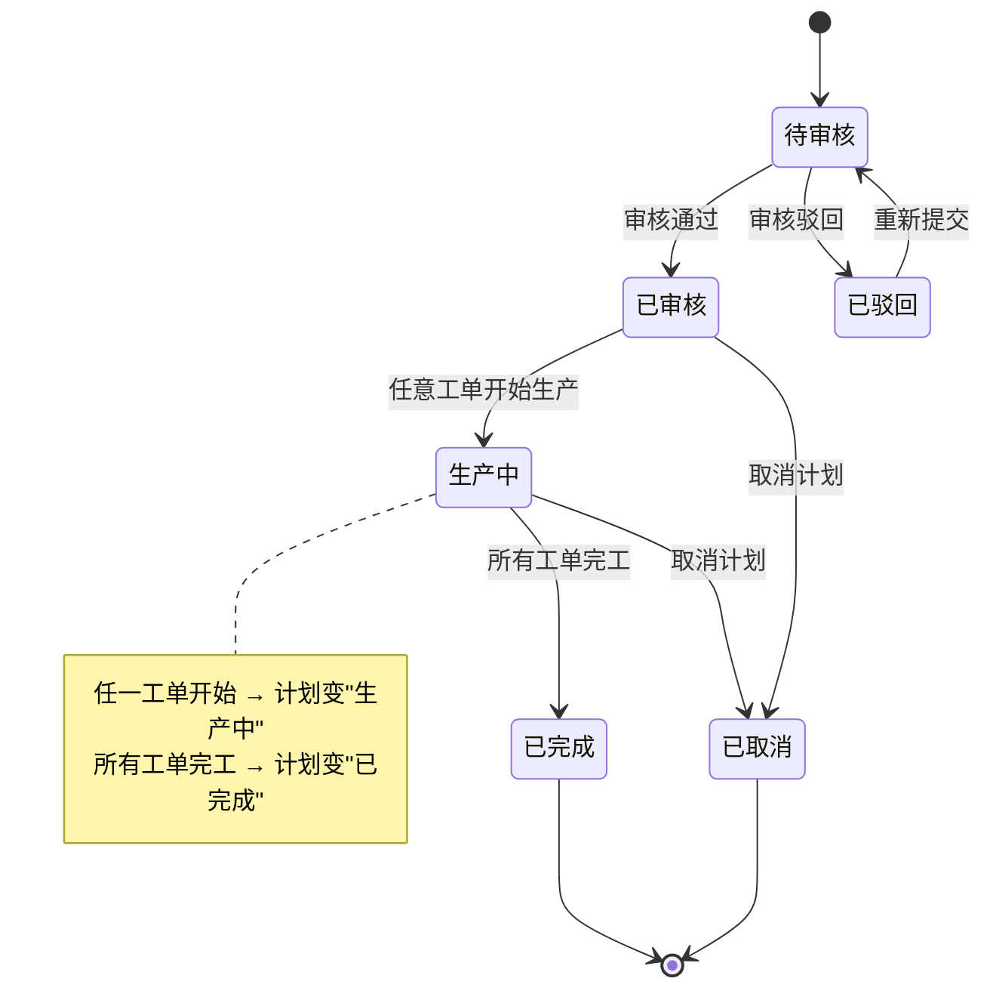
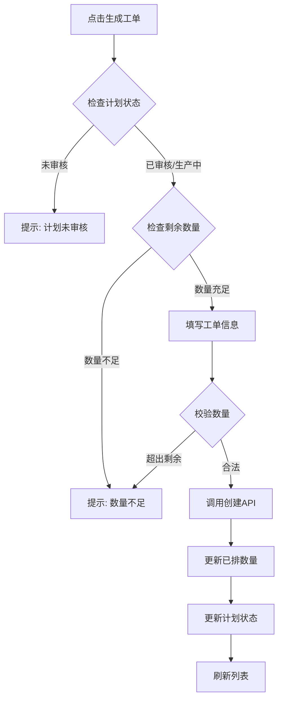

# 生产计划 ↔ 生产工单 联动方案

## 1. 需求概述

实现生产计划与生产工单之间的完整联动，包括：
- 从生产计划快速生成生产工单
- 在生产计划详情中查看关联工单
- 日期和状态的双向联动

---

## 2. 数据库结构

### 2.1 生产计划 (ProductionPlan)

| 字段 | 类型 | 说明 |
|------|------|------|
| 计划编号 | String(50) | 主键 |
| 计划状态 | String(20) | 待审核/已审核/待生产/生产中/暂停中/已完成/已取消 |
| 优先级 | String(20) | 紧急/高/普通/低 |
| 计划开始日期 | Date | - |
| 计划完成日期 | Date | - |
| 实际开始日期 | Date | - |
| 实际完成日期 | Date | - |
| 已排数量 | Integer | 已分配到工单的数量 |
| ... | ... | 其他字段略 |

### 2.2 生产工单 (ProductionOrder)

| 字段 | 类型 | 说明 |
|------|------|------|
| 工单编号 | String(50) | 主键 |
| 计划编号 | String(50) | 外键关联生产计划 |
| 工单状态 | String(20) | 待生产/生产中/暂停中/已完成/已取消 |
| 计划开始 | Date | 引用计划的计划开始日期 |
| 计划结束 | Date | 引用计划的计划结束日期 |
| 实际开始 | DateTime | - |
| 实际结束 | DateTime | - |
| ... | ... | 其他字段略 |

**说明**：生产工单不存储优先级字段，通过 `计划编号` 关联查询计划的优先级并在前端显示。

---

## 3. 联动规则

### 3.1 优先级联动

**规则**：优先级不存储在工单，通过关联查询显示
- 工单列表显示时，通过 `计划编号` 查询对应的生产计划优先级
- 前端在渲染工单列表时进行联表查询或前端关联

### 3.2 日期联动

**规则**：工单创建时引用计划日期，工单操作时回填计划日期

| 工单操作 | 更新内容 |
|----------|----------|
| 从计划生成工单 | 工单.计划开始 = 计划.计划开始日期，工单.计划结束 = 计划.计划完成日期 |
| 工单"开始生产" | 计划.实际开始日期 = 当前日期时间 |
| 工单"完工确认" | 计划.实际完成日期 = 当前日期时间 |

### 3.3 状态联动

#### 3.3.1 工单状态 → 驱动计划状态

| 工单操作 | 计划状态更新 |
|----------|--------------|
| 任意工单点击"开始生产" | 计划状态 → "生产中" |
| 所有关联工单都"完工" | 计划状态 → "已完成" |

**逻辑**：在工单 start/finish API 中检查同一计划下所有工单的状态，计算计划状态并更新。

#### 3.3.2 计划状态 → 约束工单操作

| 计划状态 | 允许的操作 |
|----------|------------|
| 待审核 | 审核通过/驳回 |
| 已审核/生产中 | 生成工单、开始生产、暂停、完工 |
| 已完成/已取消 | 禁止任何工单操作 |

**逻辑**：在工单创建和状态变更 API 中检查关联的计划状态。

---

## 4. 新增 API

### 4.1 从计划创建工单

```
POST /api/production/order/create-from-plan
```

**请求参数**：
```json
{
  "计划编号": "PC-20260401-001",
  "工单数量": 50,
  "产线": "A线"
}
```

**处理逻辑**：
1. 校验计划状态是否为"已审核"或"生产中"
2. 校验工单数量 ≤ (计划数量 - 已排数量)
3. 自动填充：产品类型、产品型号、规格、单位、计划开始、计划结束
4. 创建工单，状态默认为"待生产"，在保存的同时设置计划状态为"待生产"
5. 更新计划.已排数量 += 工单数量"

**响应**：
```json
{
  "code": 0,
  "msg": "创建成功",
  "data": { "id": 1, "工单编号": "WO-xxx" }
}
```

### 4.2 获取计划关联的工单列表

```
GET /api/production/plan/{plan_id}/orders
```

**响应**：
```json
{
  "code": 0,
  "msg": "success",
  "count": 3,
  "data": [
    { "id": 1, "工单编号": "WO-xxx", "工单状态": "生产中", ... },
    ...
  ]
}
```

### 4.3 计划状态更新

当工单状态变更时，根据以下规则更新计划状态：

| 工单状态变更 | 计划状态更新逻辑 |
|--------------|------------------|
| 保存工单save | 计划→ "待生产" |
| 任意工单 start | 计划 → "生产中" |
| 任意工单 suspend | 计划 → "暂停中" |
| 所有工单 finish | 计划 → "已完成" |
| 任意工单 cancel | 检查是否全部取消 |

---

## 5. 前端改动

### 5.1 生成工单功能

**位置**：生产计划行操作菜单

**入口**：点击"生成工单"按钮 → 弹出对话框

**对话框字段**：
| 字段 | 显示 | 可编辑 |
|------|------|--------|
| 计划编号 | 自动填充 | 否 |
| 产品类型 | 自动填充 | 否 |
| 产品型号 | 自动填充 | 否 |
| 规格 | 自动填充 | 否 |
| 单位 | 自动填充 | 否 |
| 剩余数量 | 自动计算并显示 | 否 |
| 工单数量 | 默认填入剩余数量 | 是 |
| 产线 | 下拉选择 | 是 |
| 计划开始 | 自动填充 | 否 |
| 计划结束 | 自动填充 | 否 |

**提交后**：
1. 调用 `create-from-plan` API
2. 成功后刷新计划列表和工单列表
3. 刷新当前计划的已排数量显示

### 5.2 关联工单列表

**位置**：生产计划详情对话框（新增 Tab）

**内容**：显示该计划下所有工单的列表（表格形式）

**API**：调用 `GET /api/production/plan/{plan_id}/orders`

### 5.3 状态联动显示

**工单列表**：显示关联计划的优先级（前端关联）

**操作限制**：根据计划状态禁用/启用工单操作按钮

---

## 6. 实施步骤

### 阶段1：后端 API 支持
1. 修改 `POST /production/order/create-from-plan` 实现创建工单并更新已排数量
2. 添加 `GET /production/plan/{id}/orders` 获取关联工单
3. 修改工单 start/finish API，增加回填计划日期和更新计划状态的逻辑
4. 修改工单取消 API，增加检查和更新计划状态的逻辑

### 阶段2：前端 - 生成工单功能
1. 在 `production-plan-columns.tsx` 或 `production-plan-row-actions.tsx` 添加"生成工单"按钮
2. 创建 `generate-order-dialog.tsx` 对话框组件
3. 实现对话框与 API 的交互

### 阶段3：前端 - 关联工单列表
1. 修改生产计划详情对话框，添加关联工单列表 Tab
2. 调用新 API 获取并显示关联工单

### 阶段4：前端 - 状态联动
1. 工单操作成功后调用刷新计划的 API
2. 实现操作按钮的禁用/启用逻辑

---

## 7. Mermaid 图

### 7.1 状态流转图



### 7.2 工单生成流程



---

## 8. 待确认事项

- [x] 生成工单入口：行操作菜单
- [x] 工单数量：默认填入剩余数量
- [x] 工单状态：创建时为"待生产"
- [x] 日期联动：创建时引用计划日期，开始/完工时回填
- [x] 优先级显示：仅显示不存储
- [x] 状态联动：双向联动
- [ ] 是否需要工单详情页面支持查看关联计划信息（不在本次范围内）
