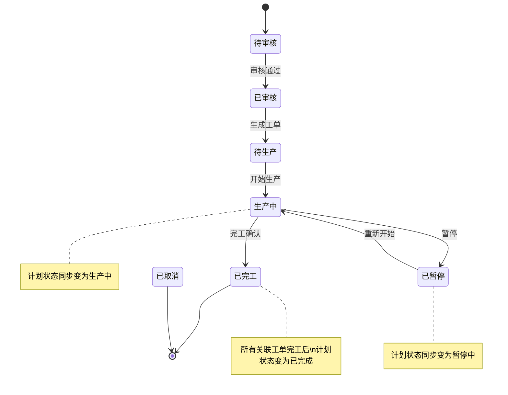

# 生产计划与生产工单联动功能方案

## 一、功能概述

实现生产计划与生产工单的联动管理：
1. 从生产计划生成生产工单
2. 查看计划的关联工单列表
3. 工单操作（开始/暂停/完工）后自动同步计划状态

---

## 二、目录结构

```
D:\shadcn-admin\
├── backend\app\
│   ├── api\production\
│   │   ├── plan.py          # 生产计划 API
│   │   └── order.py          # 生产工单 API
│   ├── services\
│   │   └── production_service.py    # 生产服务层
│   ├── repositories\
│   │   └── production_repository.py  # 生产 Repository 层
│   └── models\
│       └── production.py      # 生产 Model
│
└── src\
    ├── lib\
    │   └── production-api.ts  # 前端 API 调用
    ├── queries\production\
    │   ├── index.ts
    │   ├── keys.ts            # Query keys
    │   └── useProductionOrders.ts
    └── features\production\
        ├── ProductionPlan.tsx      # 生产计划页面
        ├── ProductionOrder.tsx     # 生产工单页面
        └── components\
            ├── production-plan-columns.tsx
            ├── production-plan-dialogs.tsx   # 详情弹窗（含关联工单 Tab）
            ├── production-plan-row-actions.tsx
            ├── production-plan-table.tsx
            ├── production-order-columns.tsx
            ├── production-order-dialogs.tsx
            ├── production-order-row-actions.tsx
            └── production-order-table.tsx
```

---

## 三、后端 API 接口

### 1. 从生产计划创建工单

**接口：** `POST /api/production/order/create-from-plan`

**请求参数：**
```json
{
  "plan_id": 5,
  "工单数量": 1200,
  "产线": "A线"
}
```

**响应：**
```json
{
  "code": 0,
  "msg": "创建成功",
  "data": {
    "id": 8,
    "工单编号": "WO-20260409-529216",
    "计划编号": "PC-20260406-001"
  }
}
```

**调用流程：**
```
API → Service.create_from_plan() → Repository.create() → DB
                      ↓
              更新计划的已排数量
```

**后端代码位置：**
- `backend/app/api/production/order.py` (L126-157)
- `backend/app/services/production_service.py` (L151-189)

---

### 2. 获取计划关联的工单列表

**接口：** `GET /api/production/plan/{plan_id}/orders`

**响应：**
```json
{
  "code": 0,
  "msg": "success",
  "count": 2,
  "data": [
    {
      "id": 8,
      "工单编号": "WO-20260409-529216",
      "产品型号": "100-S5M",
      "工单数量": 1200,
      "已完成数量": 0,
      "产线": "A线",
      "工单状态": "待生产",
      "计划编号": "PC-20260406-001"
    }
  ]
}
```

**后端代码位置：**
- `backend/app/api/production/plan.py` (L99-118)

---

### 3. 工单操作 API

| 操作 | 接口 | 状态变更 | 计划状态联动 |
|------|------|----------|-------------|
| 开始生产 | `PUT /api/production/order/start/{id}` | 待生产/已暂停 → 生产中 | 生产中 |
| 暂停 | `PUT /api/production/order/pause/{id}` | 生产中 → 已暂停 | 暂停中 |
| 完工 | `PUT /api/production/order/finish/{id}` | 生产中 → 已完工 | 已完成 |

**后端代码位置：**
- `backend/app/services/production_service.py` (L203-289)

---

## 四、前端 API 调用

**文件：** `src/lib/production-api.ts`

```typescript
// 创建工单
createFromPlan: (data: any) => api.post('/production/order/create-from-plan', data)

// 获取关联工单
getOrders: (planId: number) => api.get(`/production/plan/${planId}/orders`)

// 工单操作
start: (id: number) => api.put(`/production/order/start/${id}`)
pause: (id: number) => api.put(`/production/order/pause/${id}`)
finish: (id: number) => api.put(`/production/order/finish/${id}`)
```

---

## 五、前端组件调用流程

### 5.1 生成工单

```
ProductionPlan.tsx
  ├── handleGenerateOrder(row)     # 打开弹窗，初始化表单
  ├── handleConfirmGenerateOrder()  # 调用 API，创建成功后刷新
  └── <GenerateOrderDialog>         # 弹窗组件

production-plan-dialogs.tsx
  └── GenerateOrderDialog          # 工单数量输入 + 产线选择

production-row-actions.tsx
  └── "生成工单" 菜单项        # 条件：非待审核、有剩余数量
```

### 5.2 查看关联工单

```
ProductionPlanDetailDialog (production-plan-dialogs.tsx)
  ├── Tabs: 基本信息 | 关联工单
  ├── fetchOrders()              # 切换到关联工单 Tab 时懒加载
  └── <table> 显示工单列表
```

### 5.3 工单操作后刷新

```
ProductionOrder.tsx
  ├── handleStart/Pause/Finish()  # 调用 API
  └── setRefreshKey(k => k + 1)    # 触发刷新

production-order-table.tsx
  └── useEffect([refreshKey]) {
        queryClient.invalidateQueries(productionOrderKeys.lists())
      }
```

---

## 六、数据库约束

### 工单表状态约束 (CK_工单_状态)
```sql
[工单状态] = '待生产' OR [工单状态] = '生产中' OR [工单状态] = '已完工' OR [工单状态] = '已取消' OR [工单状态] = '已暂停'
```

### 计划表状态约束 (CK_计划_状态)
```sql
[计划状态] = '待审核' OR [计划状态] = '已审核' OR [计划状态] = '生产中' OR [计划状态] = '暂停中' OR [计划状态] = '已完成' OR [计划状态] = '已取消'
```

---

## 七、状态流转图



---

## 八、已知问题与解决方案

| 问题 | 原因 | 解决方案 |
|------|------|---------|
| 创建工单失败 | 工单编号为NULL违反约束 | 使用 generate_code('WO') 生成编号 |
| 暂停操作失败 | CHECK约束未包含"已暂停" | 数据库添加约束 |
| 事务回滚 | Repository层重复commit | 改为flush，由Service层commit |
| 删除工单失败 | 外键约束（报工/质检/入库） | 不删除关联记录，改状态为已取消 |
| 完工后计划已完成数量未更新 | finish()未累加已完成数量 | plan.已完成数量 += order.工单数量 |
| 暂停一个工单整个计划就暂停 | pause()无条件设置计划状态 | 只有所有生产中工单都暂停才设计划为暂停 |
| 开始生产后计划状态变化不合理 | start()无条件设置计划为生产中 | 只有计划在暂停中时才改为生产中 |

---

## 九、状态同步逻辑（2026-04-09 修复）

### start() - 开始生产
```python
# 只有计划在暂停中时才改为生产中
if plan.计划状态 == '暂停中':
    plan.计划状态 = '生产中'
```

### finish() - 完工确认
```python
# 累加已完成数量到计划
plan.已完成数量 += order.工单数量

# 只有所有工单都完工才将计划设为已完成
all_orders = production_order_repository.get_all_by_计划编号(db, order.计划编号)
all_finished = all(o.工单状态 == '已完工' for o in all_orders)
if all_finished:
    plan.计划状态 = '已完成'
```

### pause() - 暂停
```python
# 只有所有生产中的工单都暂停了，才将计划设为暂停
running_orders = [o for o in all_orders if o.工单状态 == '生产中']
if len(running_orders) == 0:
    finished_orders = [o for o in all_orders if o.工单状态 == '已完工']
    if len(finished_orders) == len(all_orders):
        plan.计划状态 = '已完成'  # 全部完工
    else:
        plan.计划状态 = '暂停中'  # 有工单暂停中
```

### 事务管理
- **Service 层**调用 `db.commit()`
- **API 层不调用** `db.commit()`

---

## 十、下一步优化

1. **编辑功能扩展** - ✅ 已完成
   - 工单数量编辑
   - 产线下拉选择
   - 产品型号、产品类型、规格只读显示
   - 数量变化时联动更新计划已排数量
2. **取消功能** - 专用取消接口，工单状态改为"已取消"
3. **批量操作** - 批量生成工单、批量开始/暂停
4. **工单拆分** - 一个计划生成多个工单分配到不同产线

### 编辑功能实现细节

**前端：**
- `production-order-dialogs.tsx` - ProductionOrderEditDialog 组件
  - 添加工单数量输入（type=number）
  - 产线改为 Select 下拉选择
  - 产品型号、产品类型、规格只读显示

- `ProductionOrder.tsx` - 添加 showEditDialog 监听获取 lineOptions

**后端：**
- `production_service.py` - update() 方法
  - 工单数量变化时，联动更新 plan.已排数量
  - 检查已完成数量不能超过工单数量

```python
new_工单数量 = kwargs.get('工单数量')
if new_工单数量 is not None and new_工单数量 != order.工单数量:
    plan = production_plan_repository.get_by_计划编号(db, order.计划编号)
    if plan:
        diff = new_工单数量 - order.工单数量
        plan.已排数量 += diff
```

---

## 十一、相关文档

- `D:\shadcn-admin\.opencode\documents\生产计划与生产工单联动方案.md`
