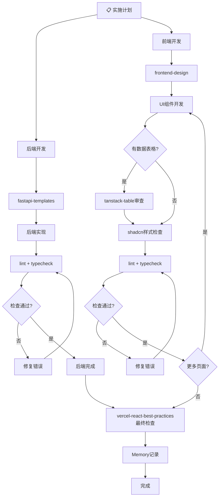

# Project Development - 完整项目实施流程

## 概述

本技能整合 SUPERPOWERS 工程流程，提供从创意到交付的完整开发路径。

**核心原则**: 严格遵循流程，每个阶段都有检查点和用户审批。

---

## 流程图



---

## 阶段详解

### 1️⃣ 头脑风暴 Brainstorming

**目的**: 将想法转化为完整的设计

**检查清单**:
- [ ] 探索上下文 - 查看项目文件、文档、相关代码
- [ ] 一次一个问题 - 理解目的/约束/成功标准
- [ ] 提出 2-3 方案 - 包含权衡分析和推荐
- [ ] 展示设计 - 分段展示，每段获批后继续
- [ ] 写入设计文档 - `docs/superpowers/specs/YYYY-MM-DD-<topic>-design.md`
- [ ] 自检 - 占位符/一致性/范围/歧义
- [ ] 用户审批 - 确认后才能进入下一步

**硬规则**: 在用户批准设计前，**绝对不能**写代码

**涉及技能**: `brainstorming`

---

### 2️⃣ 撰写设计文档 (Spec)

**保存位置**: `docs/superpowers/specs/<date>-<topic>-design.md`

**自检清单**:
- [ ] 扫描占位符 (TBD/TODO/模糊需求)
- [ ] 检查内部一致性 (架构 vs 功能描述)
- [ ] 范围检查 (是否足够一个实施计划)
- [ ] 歧义检查 (是否有多种解释)

---

### 3️⃣ 编写实施计划 (Writing Plans)

**目的**: 将设计拆解为可执行的步骤

**前后端分离模式**: 后端优先

| 阶段 | 技能 | 说明 |
|------|------|------|
| 后端开发 | `fastapi-templates` | 使用 FastAPI 模板创建后端服务 |
| 前端开发 | `frontend-design` | 使用前端设计技能创建 UI |
| 表格审查 | `tanstack-table` | 所有 TanStack Table 页面需审查 |
| 样式检查 | `shadcn` | 所有页面完成后检查样式规范 |
| 最终检查 | `vercel-react-best-practices` | 所有页面完成后进行最佳实践检查 |

**强制检查点**: 每个子任务完成后必须通过 lint + typecheck

**涉及技能**: `writing-plans`

---

### 4️⃣ 执行实现 (Subagent Driven Development)

#### 后端开发流程

1. 调用 `fastapi-templates` 技能获取 FastAPI 项目模板
2. 按照模板创建 API 层 → Service 层 → Repository 层 → Model 层
3. 完成后执行 lint + typecheck
4. 记录到 Memory MCP

#### 前端开发流程

1. 调用 `frontend-design` 技能
2. 创建页面组件和 UI 组件
3. **数据表格页面**：调用 `tanstack-table` 技能审查
4. **所有页面**：调用 `shadcn` 技能检查样式规范
5. 执行 lint + typecheck
6. 如有错误，修复后重新检查
7. 所有页面完成后，调用 `vercel-react-best-practices` 最终检查
8. 记录到 Memory MCP

**错误预防机制**:
- 每个子任务开始前，列出该任务常见错误清单
- 每个子任务完成后，必须执行 lint + typecheck
- 用 3-5 条典型数据验证功能
- 关键操作需二次确认

**涉及技能**: `subagent-driven-development`, `frontend-design`, `fastapi-templates`, `tanstack-table`, `shadcn`, `vercel-react-best-practices`

---

### 5️⃣ 自检 (Code Review)

**时机**: 实现完成后、提 PR 前

**自检清单**:
- [ ] 功能是否完整
- [ ] 代码质量/风格
- [ ] 是否有副作用
- [ ] 测试覆盖
- [ ] TanStack Table 页面已调用 `tanstack-table` 审查
- [ ] 页面样式已调用 `shadcn` 检查
- [ ] 整体已调用 `vercel-react-best-practices` 检查

**涉及技能**: `code-reviewer`, `receiving-code-review`

---

### 6️⃣ 验证测试 (Verification)

**必须验证**:
- [ ] Lint 检查
- [ ] Typecheck
- [ ] 测试通过

**涉及技能**: `verification-before-completion`

---

### 7️⃣ Playwright E2E 测试

**目的**: 对前后端进行完整的端到端测试

**测试范围**:
- 前端页面功能测试
- 后端 API 接口测试
- 登录/认证流程测试
- CRUD 操作测试
- 边界条件和错误处理测试

**执行步骤**:

1. **创建测试文件** (如 `e2e/<feature>.spec.ts`)
2. **运行测试**: `npx playwright test --project="Microsoft Edge"`
3. **生成报告**: `npx playwright show-report`
4. **分析结果**: 阅读测试报告，记录问题

**测试报告模板**:
```markdown
# Playwright E2E 测试报告

## 测试概览
| 类型 | 通过 | 失败 | 状态 |
|------|------|------|------|
| 前端测试 | X | Y | 状态 |
| API测试 | X | Y | 状态 |

## 问题清单
1. [问题描述] - [影响模块] - [建议修复]

## 改进建议
- 优先级高: ...
- 优先级中: ...
- 优先级低: ...
```

**涉及工具**: `playwright`

---

### 8️⃣ 完成 (Finishing Branch)

**选项**:
- Merge 到主分支
- 创建 PR
- 清理分支

**最后步骤**:
1. 阅读测试报告中的改进建议
2. 逐项评估并实施改进
3. 更新文档
4. 提交代码

**涉及技能**: `finishing-a-development-branch`

---

## Context7 MCP 集成

遇到问题时，使用 Context7 查询官方文档：

```bash
# 1. 解析库 ID
context7_resolve-library-id query="React hooks usage" libraryName="React"

# 2. 查询文档
context7_query-docs libraryId="/facebook/react" query="useEffect cleanup function"
```

**触发条件**:
- 不确定 API 用法时
- 遇到未知错误时
- 需要最佳实践时

---

## Memory MCP 集成

**记录时机**:
- 关键决策时
- 发现并修复 bug 时
- 完成重要里程碑时
- 遇到并解决的问题时

**记录内容**:
| 类型 | 内容 |
|------|------|
| decision | 架构选择、技术方案 |
| error | Bug原因、修复方案 |
| progress | 项目进度、里程碑 |
| insight | 重要发现、经验总结 |
| workflow | 流程改进 |

**错误记录示例**:
```typescript
memory_create_entities({
  entities: [{
    name: "error-{错误类型}",
    entityType: "error",
    observations: ["原因：...", "修复方案：...", "预防措施：..."]
  }]
})
```

---

## 关键原则

1. **YAGNI** - 彻底删除不必要的功能
2. **一次一问** - 不以问题压倒用户
3. **增量验证** - 每段设计获批后才继续
4. **设计优先** - 禁止在批准前写代码
5. **隔离与清晰** - 小而专注的模块
6. **测试驱动** - 先写测试再实现
7. **强制检查点** - 每子任务后 lint + typecheck
8. **前后端分离** - 后端优先，通过接口约定对接

---

## 快速检查清单

### 开始新任务前
- [ ] 用户需求已明确
- [ ] 相关代码已查看
- [ ] 方案已对比推荐
- [ ] 设计已获批准
- [ ] 计划已分解任务（后端 + 前端）
- [ ] Memory MCP 已记录决策

### 执行过程中
- [ ] 每个决策记录到 Memory MCP
- [ ] 遇到问题先查 Context7
- [ ] 后端完成后调用 `fastapi-templates`
- [ ] 前端页面调用 `frontend-design`
- [ ] 数据表格页面调用 `tanstack-table` 审查
- [ ] 所有页面调用 `shadcn` 样式检查
- [ ] 所有页面完成后调用 `vercel-react-best-practices`
- [ ] 每个子任务后执行 lint + typecheck
- [ ] 完成后进行自检
- [ ] 验证通过后运行 E2E 测试
- [ ] 测试报告中的改进逐项处理

---

## 相关技能

| 技能 | 用途 |
|------|------|
| brainstorming | 头脑风暴 |
| writing-plans | 实施计划 |
| subagent-driven-development | Subagent 执行 |
| frontend-design | 前端 UI 开发 |
| fastapi-templates | FastAPI 后端模板 |
| tanstack-table | TanStack Table 审查 |
| shadcn | shadcn/ui 样式检查 |
| vercel-react-best-practices | React 最佳实践检查 |
| code-reviewer | 代码自检 |
| receiving-code-review | 接收反馈 |
| verification-before-completion | 验证测试 |
| finishing-a-development-branch | 完成分支 |
| Memory MCP | 记忆系统 |
| playwright | E2E 测试 |

---

**技能版本**: 2.0
**创建时间**: 2026-04-11
**更新内容**: 前后端分离流程、强制检查点、表格审查、样式检查
