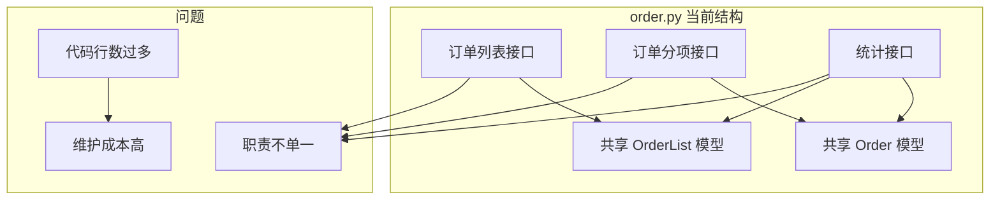
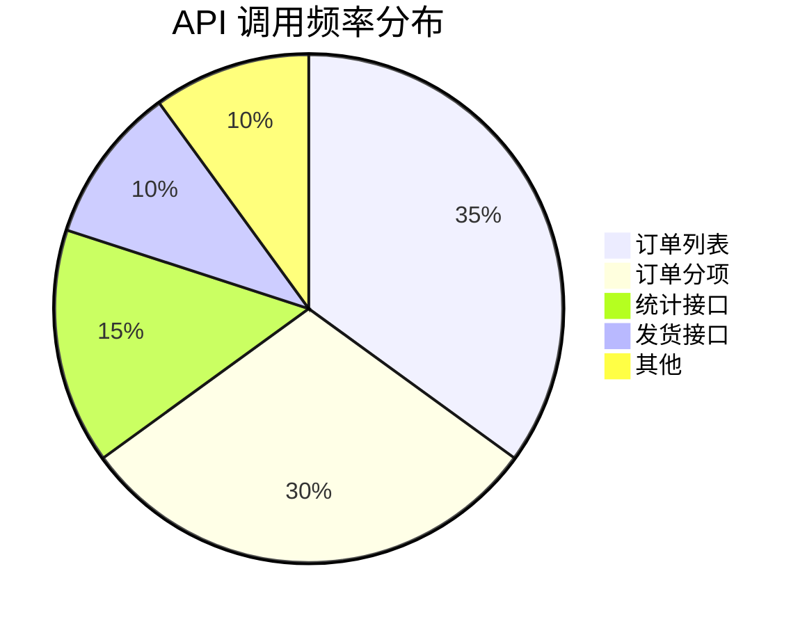

# 现有接口架构分析报告

## 一、项目概述

### 1.1 技术栈
| 层级 | 技术 | 版本 |
|------|------|------|
| 前端框架 | React + Vite | 18.x |
| UI 组件库 | Shadcn/UI | v4 |
| 状态管理 | TanStack Table | - |
| 后端框架 | FastAPI | 0.100+ |
| 数据库 | Microsoft SQL Server | - |
| ORM | SQLAlchemy | 1.4+ |

### 1.2 项目结构
```
shadcn-admin/
├── src/                          # 前端源码
│   ├── features/                 # 功能模块
│   │   ├── orders/               # 订单模块
│   │   ├── shipping/             # 发货模块
│   │   ├── customers/            # 客户模块
│   │   ├── quotes/               # 报价模块
│   │   ├── reports/              # 报表模块
│   │   ├── users/                # 用户模块
│   │   ├── tasks/                # 任务模块
│   │   ├── settings/             # 设置模块
│   │   ├── auth/                 # 认证模块
│   │   ├── dashboard/            # 仪表盘
│   │   └── ...
│   └── lib/
│       └── api.ts                # API 调用层
│
└── backend/
    └── app/
        ├── api/                  # API 路由层
        │   ├── order.py          # ⚠️ 过度集中（597行）
        │   ├── ship.py           # 发货管理
        │   ├── auth.py           # 认证管理
        │   ├── customer.py       # 客户管理
        │   ├── quote.py          # 报价管理
        │   └── report.py         # 报表管理
        ├── models/               # 数据模型
        ├── schemas/              # 数据验证
        └── main.py               # 应用入口
```

## 二、前端 API 调用分析

### 2.1 API 模块分布

| 模块 | 方法数量 | 主要功能 |
|------|----------|----------|
| `orderAPI` | 14 | 订单列表、订单分项、统计、发货 |
| `authAPI` | 3 | 登录、登出、获取用户信息 |
| `customerAPI` | 5 | 客户 CRUD |
| `quoteAPI` | 4 | 报价单 CRUD |
| `reportAPI` | 8 | 报表查询与导出 |

### 2.2 orderAPI 详细接口

```typescript
export const orderAPI = {
  // 订单列表相关
  getOrders: (params?) => api.get('/order/data', { params }),
  getAllOrders: () => api.get('/order/all'),
  createOrder: (data) => api.post('/order/create', data),
  updateOrder: (data) => api.put('/order/update_order', data),
  deleteOrder: (id) => api.delete(`/order/delete/${id}`),
  generateOrderId: () => api.get('/order/generate_order_id'),

  // 订单分项相关
  getAllOrderItems: () => api.get('/order/all-items'),
  getOrderItems: (id, params?) => api.get(`/order/items/${id}`, { params }),
  createOrderItem: (data) => api.post('/order/create_item', data),
  updateOrderItem: (data) => api.put('/order/update', data),
  deleteOrderItem: (id) => api.delete(`/order/remove/${id}`),

  // 统计相关
  getSalesStats: () => api.get('/order/stats'),
  getSalesTrend: (period) => api.get('/order/sales-trend', { params: { period } }),

  // 发货相关
  getShippingList: (params?) => api.get('/order/shipping/list', { params }),
  deleteShipping: (shippingNumber, expressNumber) => api.delete('/order/shipping/delete', {...}),
}
```

### 2.3 问题分析

| 问题 | 描述 | 影响 |
|------|------|------|
| **职责混合** | 订单列表、订单分项、统计、发货混在一起 | 代码维护困难 |
| **命名不一致** | `getOrders` vs `getAllOrders` vs `getAllOrderItems` | 调用容易混淆 |
| **路径不规范** | `/order/update` vs `/order/update_order` | API 设计不统一 |

## 三、后端接口架构分析

### 3.1 接口分布统计

| 文件 | 行数 | 接口数 | 职责 |
|------|------|--------|------|
| `order.py` | **597** | **15** | 订单列表 + 订单分项 + 统计 |
| `ship.py` | ~500 | 6 | 发货管理 |
| `report.py` | ~1500 | 9 | 报表管理 |
| `customer.py` | ~250 | 5 | 客户管理 |
| `quote.py` | ~200 | 4 | 报价管理 |
| `auth.py` | ~120 | 3 | 认证管理 |

### 3.2 order.py 接口清单

```
GET    /data                  - 获取订单列表（分页）
GET    /all                   - 获取所有订单
GET    /all-items             - 获取所有订单分项
GET    /items/{order_id}      - 获取指定订单的分项
POST   /create                - 创建订单
POST   /test_db               - 测试数据库连接
POST   /create_item           - 创建订单项
PUT    /update_order          - 更新订单
PUT    /update                - 更新订单项
DELETE /delete/{order_id}     - 删除订单
DELETE /remove/{item_id}      - 删除订单项
GET    /generate_order_id     - 生成订单编号
GET    /stats                 - 获取销售统计
GET    /sales-trend           - 获取销售趋势
```

### 3.3 耦合度评估



## 四、前端页面与接口映射

### 4.1 页面-接口映射表

| 前端页面 | 使用的 API | 调用频率 |
|----------|------------|----------|
| `OrderList.tsx` | `getOrders`, `getAllOrders`, `createOrder`, `updateOrder`, `deleteOrder` | 高 |
| `AllOrders.tsx` | `getAllOrderItems`, `updateOrderItem`, `deleteOrderItem` | 高 |
| `dashboard/index.tsx` | `getSalesStats`, `getSalesTrend` | 高 |
| `ShippingList.tsx` | `getShippingList`, `deleteShipping` | 中 |
| `UnshippedList.tsx` | `getShippingList` | 中 |
| `MonthlyReport.tsx` | `reportAPI.getMonthlyReport` | 中 |
| `CustomerList.tsx` | `customerAPI.*` | 中 |
| `QuoteList.tsx` | `quoteAPI.*` | 低 |

### 4.2 调用频率分析



## 五、问题总结

### 5.1 核心问题

1. **order.py 文件过大**：597 行代码，15 个接口，职责不单一
2. **模块边界模糊**：订单列表和订单分项混在一起
3. **统计接口位置不当**：统计功能应独立为报表模块
4. **命名不规范**：接口路径和函数命名不一致

### 5.2 影响评估

| 影响项 | 当前状态 | 目标状态 |
|--------|----------|----------|
| 单文件代码行数 | 597 行 | < 200 行 |
| 单模块接口数量 | 15 个 | 5-6 个 |
| 模块职责 | 混合 | 单一 |
| 可维护性 | 低 | 高 |
| 可测试性 | 低 | 高 |

## 六、重构建议

### 6.1 模块拆分方案

```
backend/app/api/
├── order/                    # 订单模块目录
│   ├── __init__.py
│   ├── list.py              # 订单列表接口
│   ├── item.py              # 订单分项接口
│   └── stats.py             # 订单统计接口
├── ship.py                   # 发货管理（保持不变）
├── auth.py                   # 认证管理（保持不变）
├── customer.py               # 客户管理（保持不变）
├── quote.py                  # 报价管理（保持不变）
└── report.py                 # 报表管理（保持不变）
```

### 6.2 接口迁移路径

| 原路径 | 新路径 | 模块 |
|--------|--------|------|
| `/api/order/data` | `/api/order-list/data` | list.py |
| `/api/order/all` | `/api/order-list/all` | list.py |
| `/api/order/create` | `/api/order-list/create` | list.py |
| `/api/order/update_order` | `/api/order-list/update` | list.py |
| `/api/order/delete/{id}` | `/api/order-list/delete/{id}` | list.py |
| `/api/order/generate_order_id` | `/api/order-list/generate-id` | list.py |
| `/api/order/all-items` | `/api/order-item/all` | item.py |
| `/api/order/items/{id}` | `/api/order-item/list/{id}` | item.py |
| `/api/order/create_item` | `/api/order-item/create` | item.py |
| `/api/order/update` | `/api/order-item/update` | item.py |
| `/api/order/remove/{id}` | `/api/order-item/delete/{id}` | item.py |
| `/api/order/stats` | `/api/order-stats/stats` | stats.py |
| `/api/order/sales-trend` | `/api/order-stats/trend` | stats.py |
