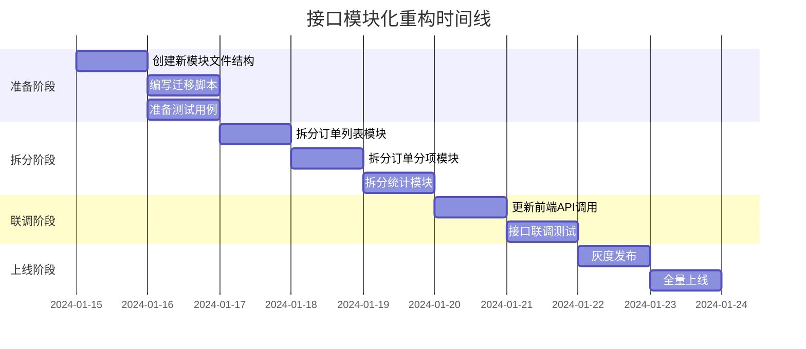

# 接口模块化重构实施步骤

## 一、实施阶段总览



## 二、准备阶段（Day 1）

### 2.1 创建新模块文件结构

#### Step 1: 创建目录结构
```bash
# 在 backend/app/api/ 下创建 order 子目录
mkdir -p backend/app/api/order
touch backend/app/api/order/__init__.py
touch backend/app/api/order/list.py
touch backend/app/api/order/item.py
touch backend/app/api/order/stats.py
```

#### Step 2: 创建 `__init__.py`
```python
# backend/app/api/order/__init__.py
from fastapi import APIRouter
from .list import router as list_router
from .item import router as item_router
from .stats import router as stats_router

router = APIRouter()
router.include_router(list_router, tags=["订单列表"])
router.include_router(item_router, tags=["订单分项"])
router.include_router(stats_router, tags=["订单统计"])
```

### 2.2 准备测试用例

#### Step 1: 创建测试文件
```bash
mkdir -p backend/tests/api
touch backend/tests/api/test_order_list.py
touch backend/tests/api/test_order_item.py
touch backend/tests/api/test_order_stats.py
```

#### Step 2: 编写基础测试用例
```python
# backend/tests/api/test_order_list.py
def test_get_order_list(client):
    response = client.get("/api/order-list/data")
    assert response.status_code == 200
    assert response.json()["code"] == 0

def test_create_order(client):
    response = client.post("/api/order-list/create", json={
        "order_number": "TEST-001",
        "customer_name": "测试客户",
        "order_date": "2024-01-15",
        "delivery_date": "2024-01-20"
    })
    assert response.status_code == 200
```

## 三、拆分阶段（Day 2-4）

### 3.1 拆分订单列表模块（Day 2）

#### Step 1: 创建 `list.py`
```python
# backend/app/api/order/list.py
from fastapi import APIRouter, Depends, Query
from sqlalchemy.orm import Session
from typing import Optional
from datetime import datetime

from app.db.database import get_db_jns
from app.models.order import OrderList

router = APIRouter()

@router.get("/data")
async def get_orders(
    page: int = Query(1, ge=1),
    pageSize: int = Query(10, ge=1),
    query: Optional[str] = None,
    id: Optional[int] = None,
    db: Session = Depends(get_db_jns)
):
    """获取订单列表（分页）"""
    # ... 从 order.py 迁移代码

@router.get("/all")
async def get_all_orders(db: Session = Depends(get_db_jns)):
    """获取所有订单"""
    # ... 从 order.py 迁移代码

@router.post("/create")
async def create_order(data: dict, db: Session = Depends(get_db_jns)):
    """创建订单"""
    # ... 从 order.py 迁移代码

@router.put("/update")
async def update_order(data: dict, db: Session = Depends(get_db_jns)):
    """更新订单"""
    # ... 从 order.py 迁移代码

@router.delete("/delete/{order_id}")
async def delete_order(order_id: int, db: Session = Depends(get_db_jns)):
    """删除订单"""
    # ... 从 order.py 迁移代码

@router.get("/generate-id")
async def generate_order_id():
    """生成订单编号"""
    # ... 从 order.py 迁移代码
```

#### Step 2: 迁移代码清单

| 原接口 | 行号范围 | 迁移目标 |
|--------|----------|----------|
| `get_orders` | 22-68 | `list.py` |
| `get_all_orders` | 71-97 | `list.py` |
| `create_order` | 191-222 | `list.py` |
| `update_order` | 334-356 | `list.py` |
| `delete_order` | 384-399 | `list.py` |
| `generate_order_id` | 419-434 | `list.py` |

### 3.2 拆分订单分项模块（Day 3）

#### Step 1: 创建 `item.py`
```python
# backend/app/api/order/item.py
from fastapi import APIRouter, Depends
from sqlalchemy.orm import Session

from app.db.database import get_db_jns
from app.models.order import Order

router = APIRouter()

@router.get("/all")
async def get_all_order_items(db: Session = Depends(get_db_jns)):
    """获取所有订单分项"""
    # ... 从 order.py 迁移代码

@router.get("/list/{order_id}")
async def get_order_items(order_id: int, db: Session = Depends(get_db_jns)):
    """获取指定订单的分项"""
    # ... 从 order.py 迁移代码

@router.post("/create")
async def create_order_item(data: dict, db: Session = Depends(get_db_jns)):
    """创建订单项"""
    # ... 从 order.py 迁移代码

@router.put("/update")
async def update_order_item(data: dict, db: Session = Depends(get_db_jns)):
    """更新订单项"""
    # ... 从 order.py 迁移代码

@router.delete("/delete/{item_id}")
async def delete_order_item(item_id: int, db: Session = Depends(get_db_jns)):
    """删除订单项"""
    # ... 从 order.py 迁移代码
```

#### Step 2: 迁移代码清单

| 原接口 | 行号范围 | 迁移目标 |
|--------|----------|----------|
| `get_all_order_items` | 100-149 | `item.py` |
| `get_order_items` | 152-188 | `item.py` |
| `create_order_item` | 257-331 | `item.py` |
| `update_order_item` | 359-381 | `item.py` |
| `delete_order_item` | 402-416 | `item.py` |

### 3.3 拆分统计模块（Day 4）

#### Step 1: 创建 `stats.py`
```python
# backend/app/api/order/stats.py
from fastapi import APIRouter, Depends, Query
from sqlalchemy.orm import Session
from sqlalchemy import func
from datetime import datetime, timedelta

from app.db.database import get_db_jns
from app.models.order import Order

router = APIRouter()

@router.get("/stats")
async def get_sales_stats(db: Session = Depends(get_db_jns)):
    """获取销售统计数据"""
    # ... 从 order.py 迁移代码

@router.get("/trend")
async def get_sales_trend(
    period: str = Query("month", regex="^(week|month|year)$"),
    db: Session = Depends(get_db_jns)
):
    """获取销售趋势数据"""
    # ... 从 order.py 迁移代码
```

#### Step 2: 迁移代码清单

| 原接口 | 行号范围 | 迁移目标 |
|--------|----------|----------|
| `get_sales_stats` | 437-491 | `stats.py` |
| `get_sales_trend` | 494-592 | `stats.py` |

## 四、联调阶段（Day 5-6）

### 4.1 更新前端 API 调用（Day 5）

#### Step 1: 更新 `api.ts`
```typescript
// frontend/src/lib/api.ts

// 订单列表 API
export const orderListAPI = {
  getOrders: (params?: any) => api.get('/order-list/data', { params }),
  getAllOrders: () => api.get('/order-list/all'),
  createOrder: (data: any) => api.post('/order-list/create', data),
  updateOrder: (data: any) => api.put('/order-list/update', data),
  deleteOrder: (id: number) => api.delete(`/order-list/delete/${id}`),
  generateOrderId: () => api.get('/order-list/generate-id'),
}

// 订单分项 API
export const orderItemAPI = {
  getAllItems: () => api.get('/order-item/all'),
  getItemsByOrderId: (orderId: number) => api.get(`/order-item/list/${orderId}`),
  createItem: (data: any) => api.post('/order-item/create', data),
  updateItem: (data: any) => api.put('/order-item/update', data),
  deleteItem: (id: number) => api.delete(`/order-item/delete/${id}`),
}

// 订单统计 API
export const orderStatsAPI = {
  getStats: () => api.get('/order-stats/stats'),
  getTrend: (period: string) => api.get('/order-stats/trend', { params: { period } }),
}

// 保持向后兼容（可选）
export const orderAPI = {
  ...orderListAPI,
  ...orderItemAPI,
  ...orderStatsAPI,
}
```

#### Step 2: 更新前端页面调用
```typescript
// frontend/src/features/orders/OrderList.tsx
// 将 orderAPI.getOrders 改为 orderListAPI.getOrders

// frontend/src/features/orders/AllOrders.tsx
// 将 orderAPI.getAllOrderItems 改为 orderItemAPI.getAllItems

// frontend/src/features/dashboard/index.tsx
// 将 orderAPI.getSalesStats 改为 orderStatsAPI.getStats
```

### 4.2 接口联调测试（Day 6）

#### Step 1: 功能测试清单
- [ ] 订单列表页面加载正常
- [ ] 订单创建功能正常
- [ ] 订单编辑功能正常
- [ ] 订单删除功能正常
- [ ] 订单分项页面加载正常
- [ ] 订单分项编辑功能正常
- [ ] 订单分项删除功能正常
- [ ] 仪表盘统计数据正常
- [ ] 销售趋势图表正常

#### Step 2: 性能测试
```bash
# 使用 ab 或 wrk 进行压力测试
ab -n 1000 -c 10 http://localhost:8001/api/order-list/data
ab -n 1000 -c 10 http://localhost:8001/api/order-item/all
```

## 五、上线阶段（Day 7-8）

### 5.1 灰度发布（Day 7）

#### Step 1: 保留旧接口兼容
```python
# backend/app/api/order.py（保留兼容层）
from fastapi import APIRouter
from .order import router as new_router

router = APIRouter()

# 重定向到新接口
@router.get("/data")
async def get_orders_compat(*args, **kwargs):
    return await new_router.routes[0].endpoint(*args, **kwargs)

# ... 其他兼容接口
```

#### Step 2: 灰度策略
- 10% 流量走新接口
- 监控错误率和响应时间
- 逐步提升到 50%、100%

### 5.2 全量上线（Day 8）

#### Step 1: 移除兼容层
```python
# 删除 backend/app/api/order.py 中的兼容代码
# 只保留 backend/app/api/order/ 目录
```

#### Step 2: 更新路由注册
```python
# backend/app/main.py
from app.api.order import router as order_router

app.include_router(order_router, prefix="/api/order", tags=["订单管理"])
```

## 六、回滚方案

### 6.1 快速回滚步骤
1. 恢复 `backend/app/api/order.py` 原始代码
2. 恢复 `frontend/src/lib/api.ts` 原始代码
3. 重启后端服务
4. 清除前端缓存

### 6.2 数据一致性保障
- 所有数据库操作保持不变
- 只涉及代码结构重组，不涉及数据迁移
