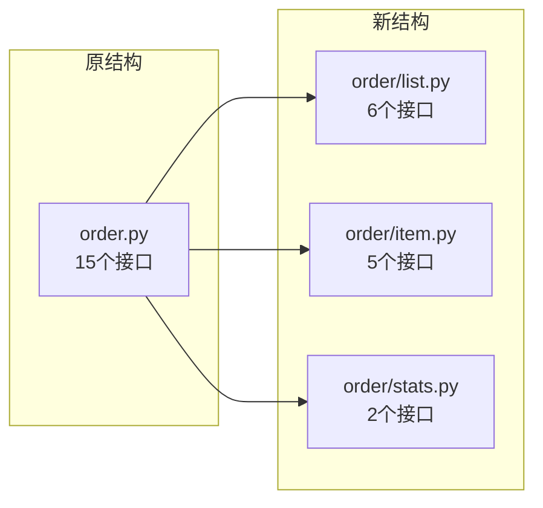
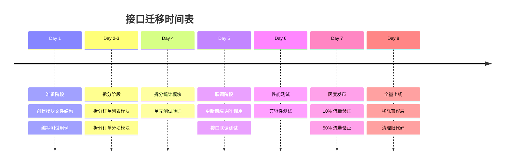

# 接口迁移清单

## 一、接口变更总览

### 1.1 变更统计

| 类别 | 数量 | 说明 |
|------|------|------|
| 新增接口 | 0 | 无新增，仅拆分 |
| 修改接口 | 15 | 路径变更，功能不变 |
| 删除接口 | 0 | 无删除，保持兼容 |
| 重命名接口 | 15 | 路径规范化 |

### 1.2 模块映射关系



## 二、详细接口变更清单

### 2.1 订单列表模块（order/list.py）

| 序号 | 原路径 | 新路径 | 方法 | 功能 |
|------|--------|--------|------|------|
| 1 | `/api/order/data` | `/api/order-list/data` | GET | 获取订单列表（分页） |
| 2 | `/api/order/all` | `/api/order-list/all` | GET | 获取所有订单 |
| 3 | `/api/order/create` | `/api/order-list/create` | POST | 创建订单 |
| 4 | `/api/order/update_order` | `/api/order-list/update` | PUT | 更新订单 |
| 5 | `/api/order/delete/{id}` | `/api/order-list/delete/{id}` | DELETE | 删除订单 |
| 6 | `/api/order/generate_order_id` | `/api/order-list/generate-id` | GET | 生成订单编号 |

### 2.2 订单分项模块（order/item.py）

| 序号 | 原路径 | 新路径 | 方法 | 功能 |
|------|--------|--------|------|------|
| 1 | `/api/order/all-items` | `/api/order-item/all` | GET | 获取所有订单分项 |
| 2 | `/api/order/items/{id}` | `/api/order-item/list/{id}` | GET | 获取指定订单的分项 |
| 3 | `/api/order/create_item` | `/api/order-item/create` | POST | 创建订单项 |
| 4 | `/api/order/update` | `/api/order-item/update` | PUT | 更新订单项 |
| 5 | `/api/order/remove/{id}` | `/api/order-item/delete/{id}` | DELETE | 删除订单项 |

### 2.3 订单统计模块（order/stats.py）

| 序号 | 原路径 | 新路径 | 方法 | 功能 |
|------|--------|--------|------|------|
| 1 | `/api/order/stats` | `/api/order-stats/stats` | GET | 获取销售统计 |
| 2 | `/api/order/sales-trend` | `/api/order-stats/trend` | GET | 获取销售趋势 |

## 三、前端 API 调用变更

### 3.1 api.ts 变更对照

#### 变更前
```typescript
export const orderAPI = {
  // 订单列表
  getOrders: (params?: any) => api.get('/order/data', { params }),
  getAllOrders: () => api.get('/order/all'),
  createOrder: (data: any) => api.post('/order/create', data),
  updateOrder: (data: any) => api.put('/order/update_order', data),
  deleteOrder: (id: number) => api.delete(`/order/delete/${id}`),
  generateOrderId: () => api.get('/order/generate_order_id'),

  // 订单分项
  getAllOrderItems: () => api.get('/order/all-items'),
  getOrderItems: (id: number, params?: any) => api.get(`/order/items/${id}`, { params }),
  createOrderItem: (data: any) => api.post('/order/create_item', data),
  updateOrderItem: (data: any) => api.put('/order/update', data),
  deleteOrderItem: (id: number) => api.delete(`/order/remove/${id}`),

  // 统计
  getSalesStats: () => api.get('/order/stats'),
  getSalesTrend: (period: string) => api.get('/order/sales-trend', { params: { period } }),
}
```

#### 变更后
```typescript
// 订单列表 API
export const orderListAPI = {
  getOrders: (params?: any) => api.get('/order-list/data', { params }),
  getAllOrders: () => api.get('/order-list/all'),
  createOrder: (data: any) => api.post('/order-list/create', data),
  updateOrder: (data: any) => api.put('/order-list/update', data),
  deleteOrder: (id: number) => api.delete(`/order-list/delete/${id}`),
  generateOrderId: () => api.get('/order-list/generate-id'),
}

// 订单分项 API
export const orderItemAPI = {
  getAllItems: () => api.get('/order-item/all'),
  getItemsByOrderId: (orderId: number) => api.get(`/order-item/list/${orderId}`),
  createItem: (data: any) => api.post('/order-item/create', data),
  updateItem: (data: any) => api.put('/order-item/update', data),
  deleteItem: (id: number) => api.delete(`/order-item/delete/${id}`),
}

// 订单统计 API
export const orderStatsAPI = {
  getStats: () => api.get('/order-stats/stats'),
  getTrend: (period: string) => api.get('/order-stats/trend', { params: { period } }),
}
```

### 3.2 页面调用变更

| 页面文件 | 原调用 | 新调用 |
|----------|--------|--------|
| `OrderList.tsx` | `orderAPI.getOrders()` | `orderListAPI.getOrders()` |
| `OrderList.tsx` | `orderAPI.createOrder()` | `orderListAPI.createOrder()` |
| `OrderList.tsx` | `orderAPI.updateOrder()` | `orderListAPI.updateOrder()` |
| `OrderList.tsx` | `orderAPI.deleteOrder()` | `orderListAPI.deleteOrder()` |
| `AllOrders.tsx` | `orderAPI.getAllOrderItems()` | `orderItemAPI.getAllItems()` |
| `AllOrders.tsx` | `orderAPI.updateOrderItem()` | `orderItemAPI.updateItem()` |
| `AllOrders.tsx` | `orderAPI.deleteOrderItem()` | `orderItemAPI.deleteItem()` |
| `dashboard/index.tsx` | `orderAPI.getSalesStats()` | `orderStatsAPI.getStats()` |
| `dashboard/index.tsx` | `orderAPI.getSalesTrend()` | `orderStatsAPI.getTrend()` |

## 四、兼容性处理方案

### 4.1 后端兼容层（过渡期）

```python
# backend/app/api/order.py（过渡期保留）
from fastapi import APIRouter
from app.api.order.list import router as list_router
from app.api.order.item import router as item_router
from app.api.order.stats import router as stats_router

router = APIRouter()

# 包含新路由
router.include_router(list_router, prefix="/list", tags=["订单列表"])
router.include_router(item_router, prefix="/item", tags=["订单分项"])
router.include_router(stats_router, prefix="/stats", tags=["订单统计"])

# 兼容旧路径（可选，过渡期后删除）
@router.get("/data")
async def get_orders_compat(*args, **kwargs):
    return await list_router.routes[0].endpoint(*args, **kwargs)

# ... 其他兼容接口
```

### 4.2 前端兼容层（过渡期）

```typescript
// frontend/src/lib/api.ts
import { orderListAPI, orderItemAPI, orderStatsAPI } from './api-modular'

// 向后兼容的 orderAPI（过渡期后删除）
export const orderAPI = {
  // 订单列表
  getOrders: orderListAPI.getOrders,
  getAllOrders: orderListAPI.getAllOrders,
  createOrder: orderListAPI.createOrder,
  updateOrder: orderListAPI.updateOrder,
  deleteOrder: orderListAPI.deleteOrder,
  generateOrderId: orderListAPI.generateOrderId,

  // 订单分项
  getAllOrderItems: orderItemAPI.getAllItems,
  getOrderItems: orderItemAPI.getItemsByOrderId,
  createOrderItem: orderItemAPI.createItem,
  updateOrderItem: orderItemAPI.updateItem,
  deleteOrderItem: orderItemAPI.deleteItem,

  // 统计
  getSalesStats: orderStatsAPI.getStats,
  getSalesTrend: orderStatsAPI.getTrend,
}
```

## 五、迁移时间表



## 六、风险控制

### 6.1 风险点识别

| 风险 | 级别 | 影响 | 应对措施 |
|------|------|------|----------|
| 接口路径变更导致前端调用失败 | 高 | 系统不可用 | 保留兼容层，灰度发布 |
| 数据库操作异常 | 中 | 数据不一致 | 事务控制，回滚机制 |
| 性能下降 | 中 | 用户体验差 | 性能测试，优化查询 |
| 测试覆盖不足 | 低 | 潜在 Bug | 完善测试用例 |

### 6.2 回滚策略

1. **代码回滚**：保留原 `order.py` 备份，随时可恢复
2. **前端回滚**：保留原 `api.ts` 备份，随时可恢复
3. **数据库回滚**：无数据库结构变更，无需回滚

## 七、验收标准

### 7.1 功能验收

- [ ] 所有原有功能正常工作
- [ ] 接口响应数据格式不变
- [ ] 前端页面显示正常
- [ ] 无新增 Bug

### 7.2 性能验收

- [ ] 接口响应时间 ≤ 原响应时间
- [ ] 并发处理能力 ≥ 原能力
- [ ] 内存占用无明显增加

### 7.3 代码质量验收

- [ ] 单文件代码行数 < 200 行
- [ ] 单模块接口数量 5-6 个
- [ ] 代码测试覆盖率 ≥ 80%
- [ ] 无 Lint 错误和警告
