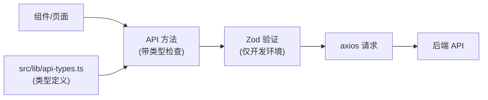

# API层类型安全设计文档

## 目标

为 `src/lib/api.ts` 中的所有 API 添加完整的 TypeScript 类型安全和 Zod 运行时验证，确保：
1. 所有 API 参数和响应都有类型定义
2. 在开发环境自动进行运行时数据验证
3. 提供清晰的 IDE 自动完成支持

## 架构



## 文件结构

```
src/lib/
├── api.ts           # API 方法（保持不变，添加类型导入）
└── api-types.ts     # 新建：所有类型和 Zod schema
```

## api-types.ts 结构

### 1. 订单模块 (Order)

```typescript
// 订单列表参数
export const orderListParamsSchema = z.object({
  query: z.literal('list').optional(),
  search: z.string().optional(),
  status: z.string().optional(),
  settlement: z.string().optional(),
  page: z.number().int().positive().optional(),
  limit: z.number().int().positive().max(100).optional(),
})

// 订单列表响应
export const orderListResponseSchema = z.object({
  code: z.number(),
  msg: z.string().optional(),
  data: z.array(orderSchema),
  total: z.number().optional(),
  count: z.number().optional(),
})

// 订单数据
export const orderSchema = z.object({
  id: z.number(),
  order_number: z.string(),
  合同编号: z.string().optional(),
  customer_name: z.string(),
  order_date: z.string(),
  delivery_date: z.string().optional(),
  status: z.boolean().optional(),
  settlement: z.string().optional(),
  // ... 其他字段
})
```

### 2. 客户模块 (Customer)
### 3. 报价模块 (Quote)
### 4. 报表模块 (Report)
### 5. 用户模块 (User)
### 6. 发货模块 (Shipping)
### 7. 其他模块 (Code, Auth, Dict)

每个模块包含：
- `*ParamsSchema` - 请求参数 Zod schema
- `*ResponseSchema` - 响应数据 Zod schema  
- `*Schema` - 数据实体 Zod schema
- `*Params` - TypeScript 类型（由 schema 推导）
- `*Response` - TypeScript 响应类型

## 验证策略

### 开发环境
- 使用 `zod)` 开发专用的验证包装器
- API 请求前验证参数格式
- API 响应后验证返回数据
- 验证失败时在控制台输出详细错误信息

### 生产环境
- 跳过运行时验证，提升性能
- 仅依赖 TypeScript 编译时类型检查

### 验证函数实现

```typescript
// 开发环境验证
function validateSchema<T>(schema: z.ZodSchema<T>, data: unknown, name: string): T {
  if (import.meta.env.DEV) {
    const result = schema.safeParse(data)
    if (!result.success) {
      console.error(`[API Validation Error] ${name}:`, result.error.format())
      throw new Error(`Invalid ${name}: ${result.error.message}`)
    }
    return result.data
  }
  return data as T
}
```

## API 方法签名变更

### 修改前
```typescript
getOrders: (params?: any) => api.get('/order/list/data', { params })
```

### 修改后
```typescript
getOrders: (params?: OrderListParams) => {
  const validatedParams = validateSchema(orderListParamsSchema, params, 'OrderListParams')
  return api.get('/order/list/data', { params: validatedParams })
}
```

## 验证计划

每修改一个 API 模块后，执行以下验证：

1. **编译检查** - 确保 TypeScript 无编译错误
2. **手动测试** - 在页面中触发对应的 API 调用
3. **功能验证** - 确认数据能正常加载和显示

### 验证清单

| 模块 | API方法 | 验证页面 | 状态 |
|------|---------|----------|------|
| Order | getOrders | /orders | 待验证 |
| Order | createOrder | /orders 新增 | 待验证 |
| Customer | getCustomers | /customers | 待验证 |
| Quote | getQuotes | /quotes | 待验证 |
| Report | getMonthlyReport | /reports | 待验证 |
| User | getUsers | /users | 待验证 |
| Shipping | getShippingList | /shipping | 待验证 |

## 实施步骤

1. 创建 `src/lib/api-types.ts`，定义所有 Zod schema 和类型
2. 创建 `src/lib/api-validation.ts`，实现验证函数
3. 修改 `src/lib/api.ts`，为每个 API 方法添加类型和验证
4. 按模块顺序进行验证：
   - Order → Customer → Quote → Report → User → Shipping → Auth
5. 运行 `npm run typecheck` 确保无类型错误
6. 手动测试各模块功能

## 风险与注意事项

1. 部分 API 响应字段可能与 schema 不匹配，需要根据实际情况调整
2. 中文字段名（如 `customer_name`、`订单编号`）直接使用字符串
3. 日期字段统一使用字符串格式，解析由业务层处理
4. 分页参数需要验证范围（page >= 1, limit <= 100）
